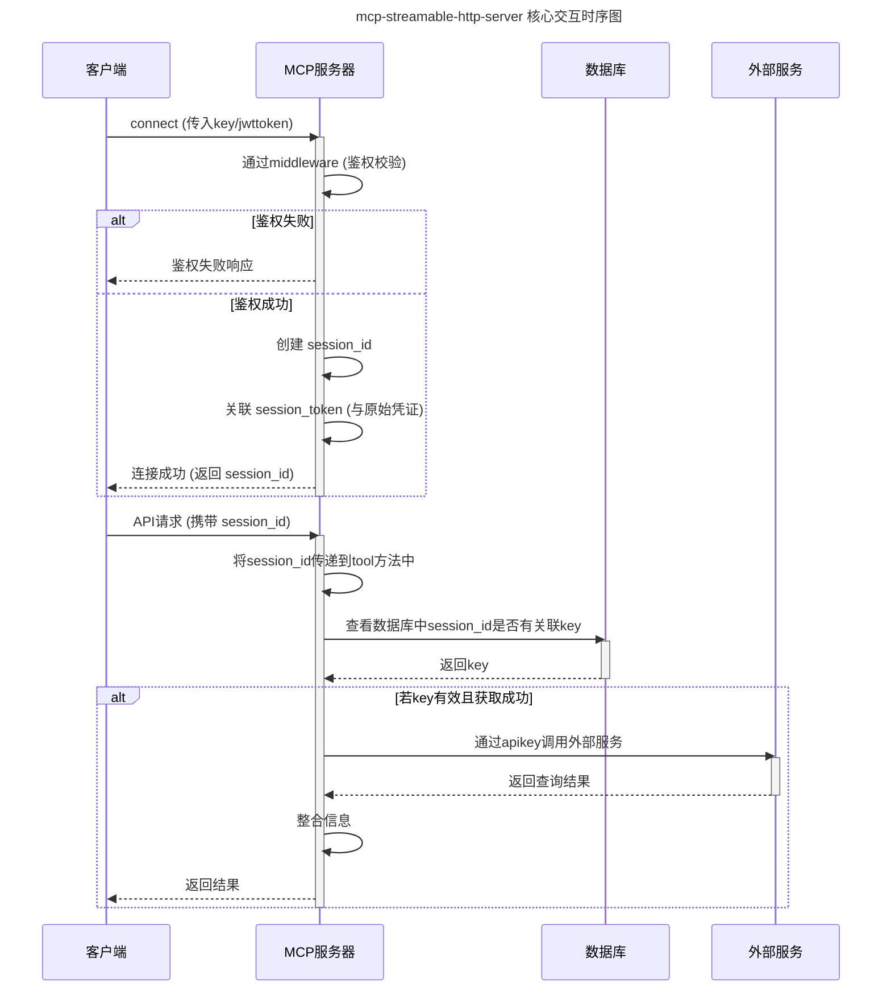

# MCP Streamable HTTP Server

[](https://opensource.org/licenses/MIT)
[](https://www.python.org/)
[](https://www.starlette.io/)
[](https://github.com/astral-sh/ruff)
[](https://pytest.org)
[](https://docs.astral.sh/uv/)
[](https://modelcontextprotocol.io/)

[简体中文](./README.md) | [English](./README.en.md)

## 📝 概述

`mcp-streamable-http-server` 项目旨在提供一个功能完善的 **StreamableHttp 服务开发模板**。具备以下核心特性：

- 🔑 **灵活的鉴权机制**：在 Streamable HTTP 传输协议下，支持通过 URL query 及 JWT token 进行参数传递与鉴权。
- 🆔 **上下文感知的用户识别**：能够通过上下文向工具 (tool) 内部传递 `session_id`，确保工具能够快速识别请求用户。
- 🔄 **动态服务注册与启动**：支持在系统运行时热注册并启动新的服务，增强了系统的灵活性和可扩展性。
- 🛡️ **可定制的中间件**：允许开发者在项目中自定义中间件 (middleware)，轻松实现 IP 拦截、高级鉴权等定制化逻辑。
- ⚙️ **便捷的工具配置**：支持通过 YAML 文件定义工具方法的输入参数，简化了配置流程，提升了开发效率。

## 目录

- [📁 项目结构](#项目结构)
- [⚙️ 项目逻辑](#项目逻辑)
- [🚀 安装](#安装)
- [🔍 Inspector 调试](#inspector-调试)
- [💡 开发示例](#开发示例)
- [🐳 Docker 安装](#docker-安装)
- [📚 文档](#文档)
- [📜 许可证](#许可证)

## 📁 项目结构

```
/mcp-streamable-http-server
├── middlewares/          # 自定义中间件
│   ├── authorize.py        #   - 认证中间件
│   ├── demo.py             #   - 示例中间件
│   └── __init__.py
├── models/               # 数据模型
│   └── session.py          #   - 会话相关模型
├── server/               # MCP 服务器核心
├── service/              # 业务服务实现
│   ├── database.py         #   - 数据库服务/操作
│   ├── example.py          #   - 示例服务
│   ├── session.py          #   - 会话管理服务
│   └── __init__.py
├── tools/                # 自定义 MCP 工具
│   ├── demo.py             #   - demo工具配置
│   ├── demo.yaml           #   - demo函数
│   ├── notify.py           #   - 通知工具配置
│   ├── notify.yaml         #   - notify函数
│   └── __init__.py
├── config.py             # 项目配置
├── .env                  # 环境变量配置文件 (本地实际配置)
├── .env.example          # 环境变量配置文件示例 (作为配置模板)
├── database.db           # SQLite 数据库
├── pyproject.toml        # Python 项目定义与依赖
└── uv.lock               # 依赖版本锁定文件
```

## ⚙️ 项目逻辑

本节描述了 `mcp-streamable-http-server` 的核心交互流程。下图通过时序图展示了客户端从连接、鉴权到通过 MCP 服务器调用工具及外部服务的关键步骤和主要组件的协作方式。



## 🚀 安装

1.  **环境要求**:

    - Python >= 3.13
    - [uv (推荐)](https://docs.astral.sh/uv/) 或 pip
    - Git

2.  **克隆项目**:

    ```bash
    git clone https://github.com/purity3/mcp-streamable-http-server.git
    cd mcp-streamable-http-server
    ```

3.  **创建并激活虚拟环境** (推荐):

    - 使用 venv:
      ```bash
      python -m venv .venv
      source .venv/bin/activate  # Linux/macOS
      # .venv\Scripts\activate    # Windows
      ```
    - 如果您使用 `pyenv` 和 `pyenv-virtualenv`，可以参照其文档。

4.  **安装依赖**:
    - 使用 uv (推荐):
      ```bash
      uv pip install -e .[dev] # 安装项目及其开发依赖
      ```
    - 或者使用 pip:
      `bash
    pip install -e .[dev] # 安装项目及其开发依赖
    `
5.  **环境配置**:
    - 复制 `.env.example` 文件为 `.env`，并根据您的本地环境需求修改其中的配置项 (例如 `DATABASE_URL`, `HOST`, `PORT` 等)。
    - (对于 SQLite) `database.db` 文件通常位于项目根目录。如果 `.env` 文件中配置的 `DATABASE_URL` 指向一个 SQLite 文件 (例如 `DATABASE_URL="sqlite:///./database.db"`) 且该文件尚不存在，服务在首次尝试访问数据库时通常会自动创建它。

6.  **启动服务**:
    - 完成上述所有配置和安装步骤后，使用以下命令启动 MCP 服务器：
      ```bash
      uv run server
      ```
    - 启动成功后，您可以根据 `.env` 文件中的 `HOST` 和 `PORT` 配置 (默认为 `http://0.0.0.0:3000` 或 `http://localhost:3000`) 访问服务。

## 🔍 Inspector 调试

可使用 [MCP Inspector](https://github.com/modelcontextprotocol/inspector) 工具进行可视化调试。

**调试步骤:**

1.  **运行 `mcp-streamable-http-server`**:
    参照"安装"部分的步骤 6 启动您的本地服务器 (默认 `http://localhost:3000`)。

2.  **启动 MCP Inspector**:
    在新的终端中执行：
    ```bash
    npx @modelcontextprotocol/inspector
    ```
    Inspector UI 默认运行在 `http://localhost:6274`。

3.  **连接服务器**:
    *   打开 Inspector UI (`http://localhost:6274`)。
    *   设置 **Transport Type**: `streamable-http`。
    *   设置 **Server URL**: 您的服务器地址，例如 `http://localhost:3000/mcp` (具体路径如 `/mcp` 可能需根据服务器路由调整)。
    *   如服务器有鉴权，请在 UI 中填写凭证。

4.  **开始调试**:
    连接成功后，即可在 Inspector UI 中查看和调用服务器的 Tools, Resources, Prompts。

更多详情请查阅 [MCP Inspector 官方文档](https://github.com/modelcontextprotocol/inspector)。


## 💡 开发示例

本节演示如何为项目添加自定义的中间件、服务和工具。

### middleware

自定义中间件用于在请求处理流程中执行通用逻辑，需继承 `McpMiddleware`。

**示例: `middlewares/demo.py` (`TestMiddleware`)**

此中间件始终允许请求通过，可作为复杂逻辑（如鉴权、日志）的起点。

```python
# middlewares/demo.py
import logging
from typing import Optional

from server.middleware.base import McpMiddleware
from server.middleware.core import RequestCredentialsContext

logger = logging.getLogger(__name__)

class TestMiddleware(McpMiddleware):
    """A test middleware that always allows requests."""

    def __init__(self):
        super().__init__()

    def __call__(self, context: RequestCredentialsContext) -> bool:
        """Always returns True, allowing the request."""
        return True
```

**集成:** 在服务器配置中注册中间件 (通常在 `server/main.py` 或类似文件中)。

### service

服务用于封装业务逻辑，继承自 `BaseService`。

**示例: `service/example.py` (`ExampleService`)**

展示了服务的基本结构，包含 `start`, `release` 和 `get_service_status` 方法。

```python
# service/example.py
import asyncio
import logging
from server.service.base import BaseService

logger = logging.getLogger(__name__)

class ExampleService(BaseService):
    """Example service for demonstration."""
    def __init__(self, name: str = "ExampleService"):
        self.name = name
        self._running = False

    async def start(self) -> None:
        """Starts the example service."""
        if self._running:
            return
        
        await asyncio.sleep(0.1)
        self._running = True

    async def release(self) -> None:
        """Releases resources held by the example service."""
        if not self._running:
            return

        self._running = False
        
        await asyncio.sleep(0.1)

    async def get_service_status(self) -> str:
        """Returns the current running status of the service."""
        status = "running" if self._running else "not running"
        return f"{self.name} is currently {status}."
```

**集成:** 服务通常在服务器启动时实例化，并通过依赖注入等方式提供给调用方。

### tools

工具是 MCP 服务器暴露的具体能力，由 Python 实现和 YAML 配置组成，继承自 `BaseTool`。

**示例: `tools/demo.py` 和 `tools/demo.yaml` (`GetSessionIdDemoTool`)**

此工具演示了如何获取 `session_id`、调用服务 (如 `SessionService`) 并结合用户输入返回结果。

**`tools/demo.yaml` (工具定义):**
```yaml
name: demo
description: A demo tool that retrieves session ID and processes a user-provided message.
inputSchema:
  type: object
  required:
    - input
  properties:
    input:
      type: string
      description: A message provided by the user.
  additionalProperties: false
source: tools/demo.py
```

**`tools/demo.py` (工具实现):**
```python
# tools/demo.py
import logging
from typing import Dict, Any, List

from server.tool.base import BaseTool
import mcp.types as types

logger = logging.getLogger(__name__)

class GetSessionIdDemoTool(BaseTool):
    """
    A demo tool to retrieve the session_id from the application context
    and process a user-provided message.
    """

    def __init__(self):
        super().__init__()
        # logger.debug("GetSessionIdDemoTool instance created.") # 示例中可省略日志

    async def _invoke(
        self, context: Any, arguments: Dict[str, Any], services: dict[str, Any]
    ) -> List[types.TextContent]:
        
        input_param = arguments.get("input")
        session_id = getattr(meta_obj, 'session_id', "N/A") if (meta_obj := getattr(context, 'meta', None)) is not None else "N/A"
        
        api_key = "N/A"
        session_service = services.get("SessionService")
        if session_service:
            try:
                api_key = session_service.get_api_key_by_session_id(session_id)
            except Exception as e:
                logger.error(f"Error getting API key from SessionService: {e}") # 保留错误日志
        
        response_text = f"Session ID: {session_id}.\\nInput: '{input_param}'.\\napi_key: {api_key}"

        return [types.TextContent(type="text", text=response_text)]
```

**集成:** 工具通过 YAML 配置自动加载。确保 `source` 指向正确的 Python 文件。

**示例: `tools/notify.py` 和 `tools/notify.yaml` (`NotificationStreamTool` - 发送通知/日志)**

此工具通过 `context.session.send_log_message` 发送日志/通知消息。

**`tools/notify.yaml` (工具定义):**
```yaml
name: notify
description: Sends a single test notification.
inputSchema:
  type: object
  properties: {} # 无输入参数
  additionalProperties: false
source: tools/notify.py
```

**`tools/notify.py` (工具实现):**
```python
# tools/notify.py
import mcp.types as types
import logging
from typing import Any

from server.tool.base import BaseTool

logger = logging.getLogger(__name__)

class NotificationStreamTool(BaseTool):
    # def __init__(self):
    #     super().__init__()
    #     logger.debug("NotificationStreamTool instance created...") # 示例中可省略日志

    async def _invoke(
        self, context: Any, arguments: dict, services: dict[str, Any]
    ) -> list[types.TextContent]: # 明确返回类型
        
        # logger.info("NotificationStreamTool _invoke called...") # 示例中可省略日志
        notification_msg = "This is a single test notification sent via session."
        
        await context.session.send_log_message(
            level="info",
            data=notification_msg,
            logger="notification_test_message_tool",
            related_request_id=context.request_id,
        )
        # logger.debug(f"Sent one actual test notification...") # 示例中可省略日志
        
        return [types.TextContent(type="text", text="Sent one actual test notification via session.")]
```
此工具调用 `context.session.send_log_message` 发送消息，可用于异步更新或调试。

## 🐳 Docker 安装

本项目支持通过 Docker 容器化运行，提供了 `Dockerfile` 和 `docker-compose.yml`。

### 使用 Dockerfile

1.  **构建镜像** (将 `mcp-streamable-http-server` 替换为你的镜像名):
    ```bash
    docker build -t mcp-streamable-http-server .
    ```

2.  **运行容器**:
    ```bash
    docker run -p 3000:3000 --name mcp-streamable-http-container -d mcp-streamable-http-server
    ```
    *   `-p 3000:3000`: 映射主机端口到容器端口。
    *   `--name`: 指定容器名称。
    *   `-d`: 后台运行。
    *   传递环境变量 (例如，用于数据库配置或调整端口)：
        ```bash
        docker run -p 3000:3000 --name mcp-streamable-http-container \
          -e DATABASE_URL="sqlite:///data/database.db" \
          -e PORT="3000" \
          # -v $(pwd)/data:/data # SQLite 数据持久化 (可选)
          -d mcp-streamable-http-server
        ```
        *(SQLite 持久化: 将容器内数据目录挂载到主机，路径需根据实际配置调整。)*

### 使用 Docker Compose (推荐本地开发)

`docker-compose.yml` 预设了服务配置，方便本地启动。

1.  **启动服务**:
    ```bash
    docker-compose up -d # -d 后台运行
    ```

2.  **查看日志** (服务名请参考 `docker-compose.yml`):
    ```bash
    docker-compose logs -f your-service-name 
    ```

3.  **停止服务**:
    ```bash
    docker-compose down # 停止并移除容器
    # docker-compose stop # 仅停止服务
    ```

**注意:**
*   确保已安装 Docker 和 Docker Compose。
*   具体环境变量、端口和卷挂载请参考 `Dockerfile` 和 `docker-compose.yml`。
*   生产部署可能需要更复杂的配置。

## 📚 文档

本项目基于官方的 Model Context Protocol (MCP) Python SDK 实现。更多关于 MCP Python SDK 的信息，请参考其官方 GitHub 仓库：
[modelcontextprotocol/python-sdk](https://github.com/modelcontextprotocol/python-sdk)

## 📜 许可证

本项目采用 MIT 许可证 - 详情请查看 `LICENSE` 文件。